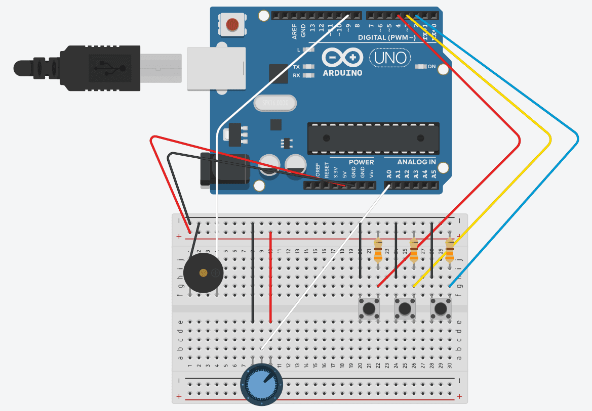

# Schematic



# Code
```

// Human hearing:  20Hz – 20kHz

int freqs[] = {1000, 1500, 2100};  // Values represent frequencies in Hz

// put your setup code here, to run once:
void setup() {
  
  Serial.begin(9600);
  pinMode(9, OUTPUT);   // Piezo 
  pinMode(2, INPUT);    // Button 1
  pinMode(3, INPUT);    // Button 2
  pinMode(4, INPUT);    // Button 3
  pinMode(A0, INPUT);   // Knob
  
}

// put your main code here, to run repeatedly:
void loop() {
  
  int sum = 0;                          // Store sum of value represented by buttons
  for(int i=0; i < 3; i++){             // i = 0 , while i = 0 or i < 3
    if(digitalRead(i+2)){               // Check if button [i] is pressed, i + 2 represents pin button is connected to
      sum += freqs[i];                  // If button i is pressed, add freqs[i] to sum
    }                                   // i + 1
  }
  tone(9, sum, 10);                     // Output pulse on pin 9, of frequency 'sum', for 10ms
  Serial.println(sum);                  // Display 'sum' on Serial monitor (magnifying glass)
  delay(analogRead(A0));                // Pause loop for number of milliseconds represented by knob value [0, 1023]
  
}
```
